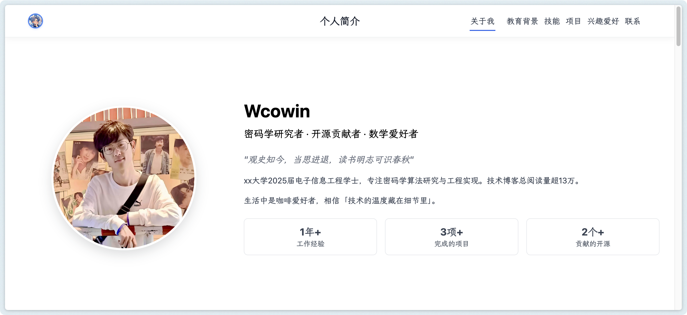
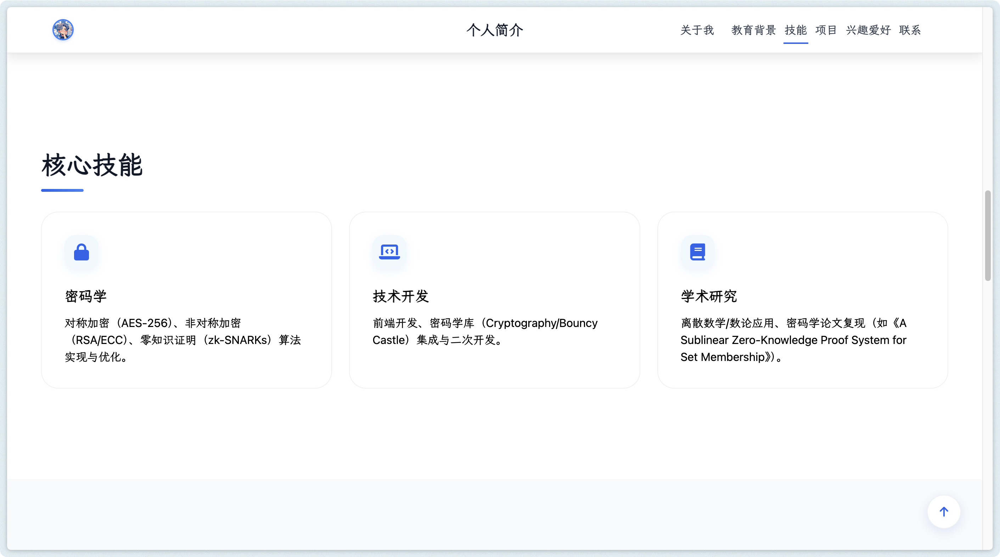
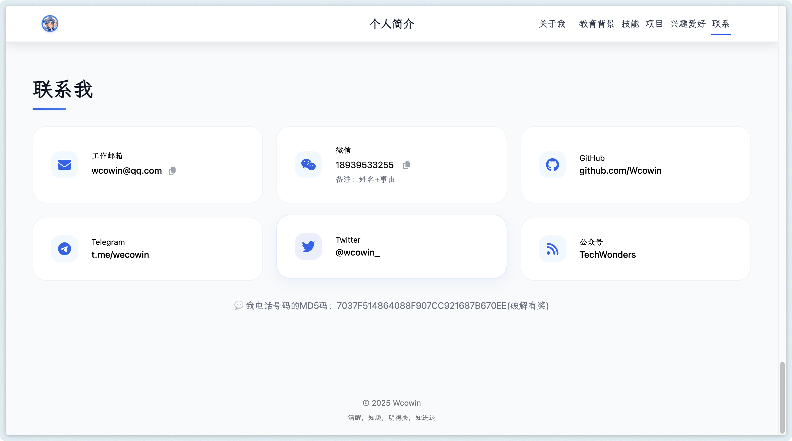

# Personal Profile - 简约个人主页







## 项目介绍

这是一个简约而专业的个人主页项目，采用现代化前端技术构建，旨在展示个人信息、技能、项目经历和联系方式等内容。网站采用响应式设计，支持各种设备访问，并具有良好的性能优化和用户体验。

## 主要特点

- ✨ **简约美观** - 精心设计的UI界面，突出个人品牌形象
- 📱 **全响应式设计** - 完美支持手机、平板和桌面设备
- ⚡ **性能优化** - 延迟加载资源，快速响应
- 🎯 **交互式体验** - 动画过渡效果和用户友好的交互

## 技术栈

- HTML5
- CSS3
- JavaScript 
- Font Awesome图标库

## 网站内容

网站包含以下几个主要部分：

1. **个人简介** - 展示基本信息和自我介绍
2. **教育背景** - 学历和教育经历
3. **核心技能** - 技术栈和专业能力
4. **代表项目** - 重要项目经历和成果
5. **兴趣爱好** - 个人爱好和生活面貌
6. **联系方式** - 多种联系渠道

## 如何使用

### 本地部署

1. 克隆项目到本地：  

   ```bash
   git clone https://github.com/yourusername/Personal-Profile.git
   cd Personal-Profile
   ```

2. 使用浏览器直接打开`wcowin.html`文件


### 自定义修改

1. **个人信息**：修改HTML文件中的个人信息、项目经历、技能等内容
2. **头像**：替换图片链接为你自己的头像URL
3. **颜色主题**：在CSS变量中修改颜色方案（位于style标签中的:root部分）
4. **联系方式**：更新个人社交媒体和联系信息

### 部署到服务器

可以将项目部署到任何静态网站托管服务上，如GitHub Pages、Netlify、Vercel等：

1. **GitHub Pages**:
   ```bash
   # 推送到GitHub仓库
   git add .
   git commit -m "Initial commit"
   git push origin main
   # 在GitHub仓库设置中启用GitHub Pages
   ```

2. **Netlify/Vercel**：
   - 在相应平台创建新项目
   - 连接GitHub仓库
   - 设置构建命令（通常无需设置，因为是静态HTML）

## 优化建议

- 压缩图片以提高加载速度
- 考虑使用CDN加载第三方库
- 考虑添加一个简单的博客部分
- 根据系统设置自动切换明/暗模式

## 许可

MIT © [Wcowin](https://github.com/Wcowin)

---

✨ 如果您喜欢这个项目，欢迎Star！
